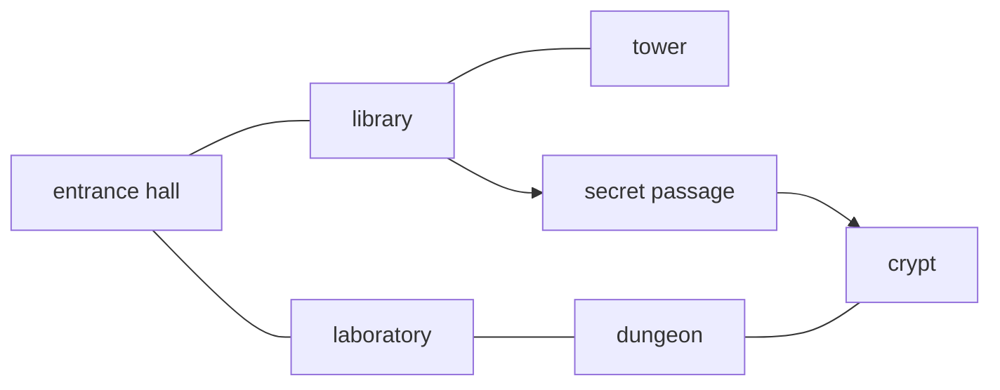

# The Haunted Castle

A small Java project that loads a text-adventure world from a plain-text map file and builds it as objects: rooms, characters and items. Built to practise object-oriented design in Java, including interfaces, abstract classes, inheritance, polymorphism and packages.

## What it does

1. Reads `hauntedcastle.txt` and creates every room, connection, character and item described in it.
2. Prints each room with the rooms you can reach from it and what's inside.
3. Shows that characters and items can both be stored as a `GameEntity` while keeping their real class.
4. Runs a short fight between a Fighter and a Vampire.
5. Looks up an item by name.

## Sample output

```
*** The Haunted Castle ***

== entrance hall ==
Accessible rooms: [library, laboratory]
Contents:
  - Sir Roderick (Fighter)
  - iron key (Item)

== library ==
Accessible rooms: [entrance hall, tower, secret passage]
Contents:
  - Elowen (Mage)
  - ancient tome (Item)

...

*** Interface Check ***
Sir Roderick is stored as a GameEntity, but is really a Fighter.
iron key is also stored as a GameEntity, but is really an Item.

*** A Small Encounter ***
Sir Roderick punches Count Orlok.
Count Orlok now has 58 health.
Count Orlok bites Sir Roderick.
Sir Roderick now has 35 health.

*** An Item Lookup ***
Found item: silver dagger

Done.
```

Rooms are stored in a `HashMap`, so they may print in a different order than they appear in the file.

## How to run

**Requirements:** JDK 8 or newer.

The program looks for `hauntedcastle.txt` in the working directory, so always run it from the project root.

### IntelliJ IDEA

Open the project folder, then run `Main.java`. IntelliJ uses the project root as the working directory by default.

### Command line

macOS / Linux / Git Bash:
```bash
javac -d out $(find src -name "*.java")
java -cp out Main
```

Windows PowerShell:
```powershell
javac -d out (Get-ChildItem -Recurse src -Filter *.java).FullName
java -cp out Main
```

## The castle



Plain lines are two-way connections. Arrows are one-way, so the secret passage leads to the crypt, but there's no way back.

| Room | Character | Item |
|---|---|---|
| entrance hall | Sir Roderick (Fighter) | iron key |
| library | Elowen (Mage) | ancient tome |
| laboratory | Ooze (Slime) | glowing potion |
| dungeon | Old Bones (Skeleton) | |
| crypt | Count Orlok (Vampire) | silver dagger |
| tower | | brass telescope |
| secret passage | | |

## Map file format

Each line is one command. Blank lines are skipped. Use underscores instead of spaces in names; the loader turns `entrance_hall` into `entrance hall`.

| Command | Example | Meaning |
|---|---|---|
| `ROOM name` | `ROOM library` | Create a room |
| `CONNECT a b` | `CONNECT library tower` | Two-way passage between `a` and `b` |
| `LEADS_TO a b` | `LEADS_TO library secret_passage` | One-way passage from `a` to `b` |
| `FIGHTER name room` | `FIGHTER Sir_Roderick entrance_hall` | Place a Fighter in a room |
| `MAGE name room` | `MAGE Elowen library` | Place a Mage |
| `VAMPIRE name room` | `VAMPIRE Count_Orlok crypt` | Place a Vampire |
| `SKELETON name room` | `SKELETON Old_Bones dungeon` | Place a Skeleton |
| `SLIME name room` | `SLIME Ooze laboratory` | Place a Slime |
| `ITEM name room` | `ITEM iron_key entrance_hall` | Place an item |

A room must be declared with `ROOM` before any line refers to it. The loader throws an `IOException` if:
- a line has the wrong number of words,
- a line refers to a room that doesn't exist, or
- a line starts with an unknown command.

## Characters

| Class | Side | Max health | Strength | Undead | Attack |
|---|---|---|---|---|---|
| Fighter | Player | 60 | 42 | No | punches |
| Mage | Player | 35 | 2 | No | casts magic on |
| Vampire | Monster | 100 | 25 | Yes | bites |
| Skeleton | Monster | 25 | 10 | Yes | slashes |
| Slime | Monster | 70 | 5 | No | slimes |

- **Default attack:** deals damage equal to the attacker's strength. Health never drops below 0.
- **Mage:** ignores strength and attacks with a pool of 20 magic. Each attack deals as much damage as it can from the remaining magic and uses up that much magic.
- **Slime:** deals damage equal to its own current health, so it gets weaker as it's hurt.
- **Health potion:** heals 20 for living characters but deals 20 damage to undead ones.

## Design

```
GameEntity (interface)
├── Item
└── GameCharacter (abstract)
    ├── PlayerCharacter (abstract)
    │   ├── Fighter
    │   └── Mage
    └── Monster (abstract)
        ├── Vampire
        ├── Skeleton
        └── Slime
```

- **`GameEntity`** is the shared interface for anything that can sit in a room. A `Room` keeps a single `List<GameEntity>`, so characters and items live in the same list.
- **`GameCharacter`** holds health, strength, attacking and potion logic. Subclasses override `attack()`, `attackAction()` and `isUndead()` to change behaviour.
- **`GameData`** stores rooms, characters and items in `HashMap`s for lookup by name.
- **`GameLoader`** parses the map file line by line with `Scanner` and builds the `GameData`.

## Project structure

```
├── src/
│   ├── Main.java                    # Entry point: loads the castle and runs the demo
│   ├── game/
│   │   ├── GameEntity.java          # Interface for anything placed in a room
│   │   ├── GameData.java            # Lookup tables for rooms, characters, items
│   │   └── GameLoader.java          # Parses the map file
│   ├── game_character/
│   │   ├── GameCharacter.java       # Base class: health, strength, attack
│   │   ├── player_character/
│   │   │   ├── PlayerCharacter.java
│   │   │   ├── Fighter.java
│   │   │   └── Mage.java
│   │   └── monster/
│   │       ├── Monster.java
│   │       ├── Vampire.java
│   │       ├── Skeleton.java
│   │       └── Slime.java
│   ├── item/
│   │   └── Item.java
│   └── room/
│       └── Room.java                # Room contents and connections
├── hauntedcastle.txt                # The castle map
└── lab2.iml                         # IntelliJ module file
```
